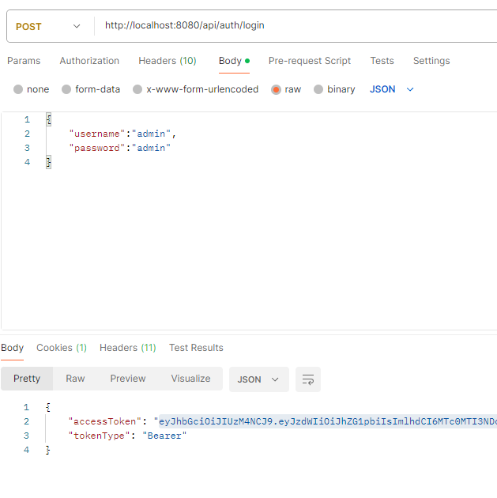

suivi du tuto https://www.sourcecodeexamples.net/2024/01/spring-boot-jwt-authentication-and-authorization-example.html

juste une modification sur le JwtTokenProvider {

    private String jwtSecret="daf66e01593f61a15b857cf433aae03a005812b31234e149036bcc8dee755dbb";
    private long jwtExpirationDate=604800000;

    public JwtTokenProvider(String jwtSecret, long jwtExpirationDate) {
    	this.jwtSecret = jwtSecret;
    	this.jwtExpirationDate = jwtExpirationDate;
    } //...

}
tests avec postman ok

ajout de la recherche des sites, ajouter copie d'écran

